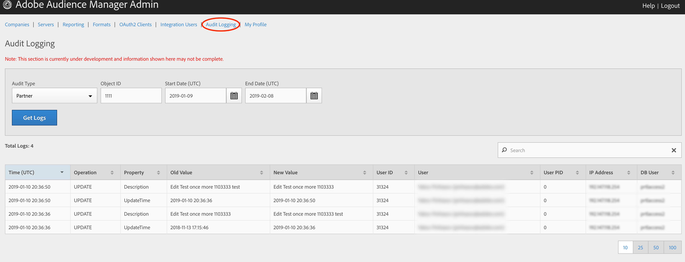

# Registrazione controllo {#audit-logging}

Utilizzate [!UICONTROL  Audit Logging] come punto di partenza per il debug dei problemi dei clienti.

> [!NOTE]
>
>[!UICONTROL Audit Logging] è attualmente in fase di sviluppo e soggetto a modifiche. Registrare eventuali problemi riscontrati [!DNL JIRA] ([!DNL UI] team)

Nel selettore a discesa **Tipo** di controllo, scegliete tra:

* [!UICONTROL Partner]
* [!UICONTROL User]
* [!UICONTROL Group]
* [!UICONTROL Datasource Summary]
* [!UICONTROL General Datasource]
* [!UICONTROL Merge Rule Datasource]
* [!UICONTROL Data Feed]
* [!UICONTROL Data Feed Subscription]
* [!UICONTROL Trait Summary]
* [!UICONTROL Trait Rule]
* [!UICONTROL Segment Summary]
* [!UICONTROL Destination Summary]
* [!UICONTROL Server to Server Destination]
* [!UICONTROL Derived Signal]
* [!UICONTROL Model]
* [!UICONTROL Segment Test Group]

L'ID **** oggetto è l'ID dell'elemento di cui si sta eseguendo la ricerca. Vedi la tabella seguente per cui l’ID corrisponde all’ID oggetto in ogni caso:

| Tipo di controllo | ID oggetto |
---------|----------|
| [!UICONTROL Partner] | ID partner - PID |
| [!UICONTROL User] | ID utente |
| [!UICONTROL Group] | B3 |
| [!UICONTROL Datasource Summary] | ID origine dati |
| [!UICONTROL General Datasource] | ID origine dati |
| [!UICONTROL Merge Rule Datasource] | ID origine dati |
| [!UICONTROL Data Feed] | ID feed dati |
| [!UICONTROL Data Feed Subscription] | ID feed dati |
| [!UICONTROL Trait Summary] | SID (caratteristica) |
| [!UICONTROL Trait Rule] | SID (caratteristica) |
| [!UICONTROL Segment Summary] |  |
| [!UICONTROL Destination Summary] |  |
| [!UICONTROL Server-to-Server Destination] | N/D |
| [!UICONTROL Derived Signal] | N/D |
| [!UICONTROL Model] | N/D |
| [!UICONTROL Segment Test Group] | N/D |

Utilizzate [!UICONTROL Start Date] ([!DNL UTC]) e [!UICONTROL End Date] ([!DNL UTC]) per restringere l'intervallo di tempo dei registri.