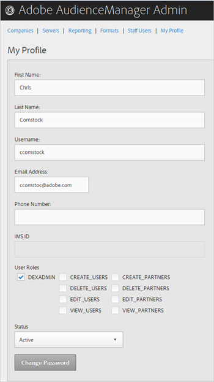
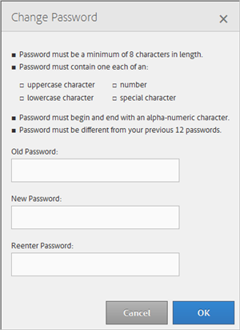

# Profilo personale {#my-profile}

Modifica i dettagli del profilo dello strumento di amministrazione di Audience Manager o modifica la password.

<!-- c_my_profile.xml -->

## Modifica profilo {#edit-profile}

Visualizza e modifica il profilo dello strumento Amministrazione Audience Manager, inclusi nome e cognome, nome utente, indirizzo e-mail, numero di telefono, [!UICONTROL IMS ID]ruoli utente e stato.

<!-- t_edit_profile.xml -->

1. Fai clic su **[!UICONTROL My Profile]**.

   

2. Compila i campi:
   * **[!UICONTROL First Name]** : (Obbligatorio) Specificate il vostro nome.
   * **[!UICONTROL Last Name]** : (Obbligatorio) Specifica il cognome.
   * **[!UICONTROL Username]** : (Obbligatorio) Specificate il primo nome utente.
   * **[!UICONTROL Email Address]** : (Obbligatorio) Specificate il vostro indirizzo e-mail.
   * **[!UICONTROL Phone Number]** : Specificate il vostro numero di telefono.
   * **[!UICONTROL IMS ID]** : Specificate il vostro ID servizio di messaggistica Internet.
   * **[!UICONTROL User Roles]** : Selezionate i ruoli utente desiderati:
      * **[!UICONTROL DEXADMIN]** : Fornisce l'accesso dell'amministratore per eseguire attività nello strumento di amministrazione di Audience Manager. Se non selezionate questa opzione, potete scegliere i singoli ruoli. Questi ruoli consentono agli utenti di eseguire attività mediante [!DNL API] chiamate, ma non nello strumento Admin.
      * **[!UICONTROL CREATE_USERS]** : Consente agli utenti di creare nuovi utenti tramite una [!DNL API] chiamata.
      * **[!UICONTROL DELETE_USERS]** : Consente agli utenti di eliminare gli utenti esistenti utilizzando una [!DNL API] chiamata.
      * **[!UICONTROL EDIT_USERS]** : Consente agli utenti di modificare gli utenti esistenti utilizzando una [!DNL API] chiamata.
      * **[!UICONTROL VIEW_USERS]** : Consente agli utenti di visualizzare altri utenti nella configurazione di Audience Manager mediante una [!DNL API] chiamata.
      * **[!UICONTROL CREATE_PARTNERS]** : Consente agli utenti di creare partner Audience Manager tramite una [!DNL API] chiamata.
      * **[!UICONTROL DELETE_PARTNERS]** : Consente agli utenti di eliminare i partner Audience Manager utilizzando una [!DNL API] chiamata.
      * **[!UICONTROL EDIT_PARTNERS]** : Consente agli utenti di modificare i partner Audience Manager utilizzando una [!DNL API] chiamata.
      * **[!UICONTROL VIEW_PARNTERS]** : Consente agli utenti di visualizzare i partner Audience Manager utilizzando una [!DNL API] chiamata.
   * **[!UICONTROL Status]** : Selezionate lo stato desiderato:
      * **[!UICONTROL Active]** : Specifica che questo utente è in un utente Audience Manager attivo.
      * **[!UICONTROL Deactivated]** : Specifica che questo utente è un utente disattivato in Gestione dell'audience.
      * **[!UICONTROL Expired]** : Specifica che l'account di questo utente in Audience Manager è scaduto.
      * **[!UICONTROL Locked Out]** : Specifica che l'account di questo utente in Audience Manager è bloccato.
3. Fai clic su **[!UICONTROL Submit]**.

## Cambia password {#change-password}

Modifica la password dello strumento di amministrazione di Audience Manager.

<!-- t_change_password.xml -->

1. Fai clic su **[!UICONTROL My Profile]**.
1. Fai clic su **[!UICONTROL Change Password]**.

   

   La password di Audience Manager deve essere:

   * almeno otto caratteri;
   * Contenere un carattere maiuscolo;
   * Contiene almeno un carattere minuscolo;
   * Contiene almeno un numero;
   * contenere almeno un carattere speciale;
   * Inizia e termina con un carattere alfanumerico;
   * Iniziare e terminare con un carattere alfanumerico.

1. Specificate la vecchia password.
1. Specificate la nuova password, quindi confermate la nuova password.
1. Fai clic su **[!UICONTROL OK]**.