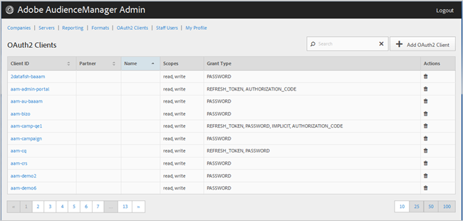

# Client oauth 2 {#oauth-clients}

Utilizzate [!UICONTROL OAuth2 Clients] la pagina per visualizzare un elenco [!UICONTROL OAuth2] dei client [!DNL Audience Manager] nella configurazione. Potete modificare o eliminare i client esistenti oppure creare nuovi client, a condizione che disponiate dei ruoli utente appropriati.

## Panoramica {#overview}

<!-- c_oauth.xml -->

>[!NOTE]
>
>Assicurati che il cliente legge la [documentazione oauth 2](https://docs.adobe.com/content/help/en/audience-manager/user-guide/api-and-sdk-code/rest-apis/aam-api-getting-started.html#oauth) in [! Guida utente di DNL Audience Manager.

[!DNL OAuth2] è uno standard aperto per l'autorizzazione che fornisce l'accesso protetto alle [!DNL Audience Manager] risorse per conto del proprietario di una risorsa.

Potete ordinare ciascuna colonna in ordine crescente o decrescente facendo clic sull'intestazione della colonna desiderata.

Utilizzate la [!UICONTROL Search] casella o i controlli di impaginazione in fondo all'elenco per trovare il client desiderato.

## Creare o modificare un client oauth 2 {#create-edit-client}

<!-- t_create_edit_auth.xml -->

Utilizzate la [!UICONTROL OAuth2 Clients] pagina dello strumento Audience Manager [!UICONTROL Admin] per creare un nuovo [!UICONTROL Oauth2] client o modificare un client esistente.

1. Per creare un [!UICONTROL OAuth2] nuovo client, fate clic **[!UICONTROL OAuth2 Clients]** su &gt; **[!UICONTROL Add OAuth2 Client]**. Per modificare un [!UICONTROL OAuth2] client esistente, fate clic sul client desiderato nella **[!UICONTROL Client ID]** colonna.
1. Specificate il nome desiderato per il [!UICONTROL OAuth2] client. Si noti che si tratta di un nome solo per il record.
1. Specificate l'indirizzo e-mail [!UICONTROL OAuth2] del client. Esiste un limite di un indirizzo e-mail.
1. Dall'elenco **[!UICONTROL Partner]** a discesa, selezionate il partner desiderato.
1. Nella **[!UICONTROL Client ID]** casella, specificate l'ID desiderato. Questo è il valore utilizzato per l'invio [!DNL API] delle richieste. Il prefisso viene compilato automaticamente quando iniziate a digitare dopo aver selezionato un [!UICONTROL Partner] 'opzione dall'elenco a discesa nel passaggio precedente. Il formato corretto è &lt; *`partner subdomain`*&gt; - &lt; *`Audience Manager username`*&gt;.
1. Seleziona o deseleziona la casella **[!UICONTROL Restrict to Partner Users]** di controllo, a seconda delle necessità. Se questa casella di controllo è selezionata, l'utente deve essere un [!DNL Audience Manager] utente elencato per il partner selezionato. Come procedura ottimale, consigliamo di selezionare questa opzione.
1. Nella **[!UICONTROL Scope]** sezione, seleziona o deseleziona le caselle **[!UICONTROL Read]** di **[!UICONTROL Write]** selezione, come desiderato.
1. Nella **[!UICONTROL Grant Type]** sezione, selezionate i mezzi desiderati per l'autorizzazione. È consigliabile utilizzare le impostazioni predefinite e [!UICONTROL Password][!UICONTROL Refresh-token] le opzioni.

   * **[!UICONTROL Implicit]**: Se selezionate questa opzione, la [!UICONTROL Redirect URI] casella viene attivata. All'utente viene assegnato un token di accesso automatico dopo essere stato autenticato e inviato immediatamente al reindirizzamento [!DNL URI].
   * **[!UICONTROL Authorization Code]**: Se selezionate questa opzione, la [!UICONTROL Redirect URI] casella viene attivata. L'utente viene restituito al client dopo essere stato autenticato e quindi inviato al reindirizzamento [!DNL URI].
   * **[!UICONTROL Password]**: L'utente viene autenticato con una password immessa dall'utente anziché tramite un tentativo di convalida automatica tramite un server di autorizzazione.
   * **[!UICONTROL Refresh_token]**: Utilizzato per aggiornare un token di accesso scaduto per un periodo di tempo prolungato.

1. Nella **[!UICONTROL Redirect URI]** casella, specificate l'impostazione [!DNL URI]desiderata. Questa opzione è abilitata solo se selezionate i tipi **[!UICONTROL Implicit]** e **[!UICONTROL Authorization_code]** i tipi di sovvenzione. **[!UICONTROL Redirect URI]** La casella consente di specificare un valore separato da virgole di [!DNL URI] valori validi. Si tratta dell' [!DNL URI] utente a cui viene reindirizzato un client dopo l'approvazione del client per [!DNL API] l'accesso.
1. Specificate la durata di scadenza desiderata (in secondi) per accedere e aggiornare la scadenza token.

   * **[!UICONTROL Access Token Expiration Time]**: Il numero di secondi in cui un token di accesso è valido dopo essere stato emesso. Può essere null per utilizzare la piattaforma predefinita (12 ore). Inoltre, può essere -1 per indicare che il token di accesso non scade.
   * **[!UICONTROL Refresh Token Expiration Time]**: Validità di un token di aggiornamento dopo l'emissione. Può essere null per utilizzare la piattaforma predefinita (30 giorni).

1. Fai clic su **[!UICONTROL Save]**.

Per eliminare un [!UICONTROL OAuth2] client, fate clic su **[!UICONTROL OAuth2 Clients]**, quindi fate clic  sulla **[!UICONTROL Actions]** colonna del client desiderato.

>[!MORE_ LIKE_ THIS]
>
>* [Requisiti API e Recommendations](../admin-oauth2/aam-admin-api-requirements.md)

