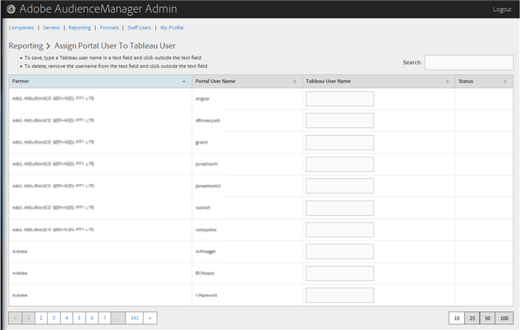

# Assegnazione di un utente del portale a un utente di tabella {#assign-a-portal-user-to-tableau-user}

<!-- t_tabeau.xml -->

Utilizzare la pagina [!UICONTROL Reporting] per rendere un utente del portale [!DNL Tableau]. Questo consente agli utenti di visualizzare i rapporti [!DNL Tableau]  Audience Manager.

1. Clic **[!UICONTROL Reporting]** > **[!UICONTROL Assign Portal User to Tableau User]**.

   

1. Per assegnare un utente, nella riga partner desiderata digitare un nome utente [!DNL Tableau] nel campo di testo, quindi fare clic all&#39;esterno del campo di testo.

Per eliminare una firma utente, nella riga partner desiderata rimuovere il nome utente dal campo di testo, quindi fare clic all&#39;esterno del campo di testo.
