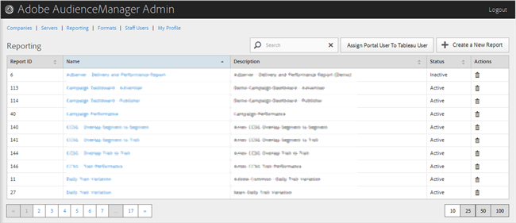

# Reporting {#reporting}

Gestire i rapporti  Audience Manager creando nuovi rapporti o modificando o eliminando quelli esistenti. Potete anche assegnare un utente del portale come utente [!DNL Tableau].

<!-- c_reporting.xml -->

Potete ordinare ciascuna colonna in ordine crescente o decrescente facendo clic sull’intestazione della colonna desiderata.

Utilizzate la casella [!UICONTROL Search] o i controlli di impaginazione in fondo all&#39;elenco per trovare il rapporto desiderato.
