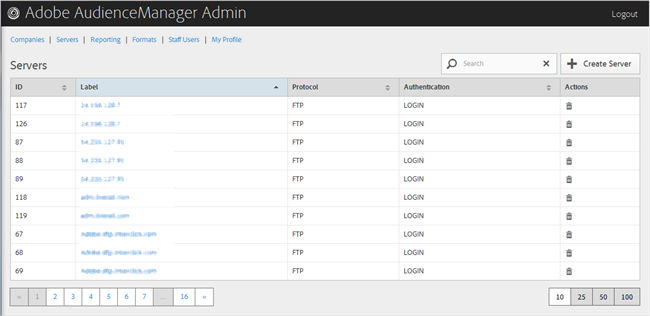

# Eliminare un server {#delete-a-server}

Utilizza la [!UICONTROL Servers] pagina nello strumento Amministrazione di Audience Manager per eliminare un server esistente.

<!-- t_delete_server.xml -->

>[!NOTE]
>
>Per eliminare i server esistenti dovete avere [!UICONTROL DEXADMIN] il ruolo necessario.

1. Per eliminare un server esistente, fate clic **[!UICONTROL Servers]** su.

   

1. Fate clic sulla **[!UICONTROL Actions]** colonna del server desiderato.
1. Click **[!UICONTROL OK]** to confirm the deletion.
