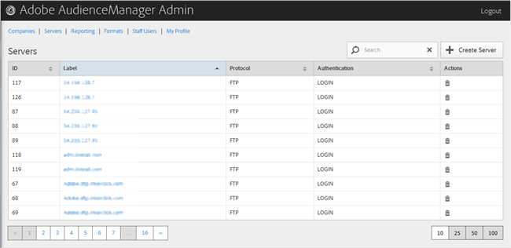

# Panoramica dei server {#servers-overview}

Utilizza il [!UICONTROL Servers] per visualizzare un elenco di server nella configurazione dell’Audience Manager. È possibile modificare o eliminare server esistenti o crearne di nuovi, purché siano stati assegnati i ruoli utente appropriati.

<!-- c_servers.xml -->

Puoi ordinare ogni colonna in ordine crescente o decrescente facendo clic sull’intestazione della colonna desiderata. Utilizza il [!UICONTROL Search] o i controlli di impaginazione nella parte inferiore dell&#39;elenco per trovare il server desiderato.
