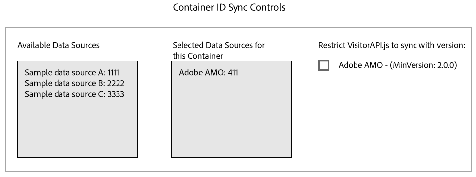

# Sincronizzazione ID con Media Optimizer {#id-syncing-with-media-optimizer}

Per impostazione predefinita, tutte le società sincronizzano i dati con [!DNL Adobe Media Optimizer] ([!DNL AMO]). In [!UICONTROL Admin UI], ogni contenitore società dispone di un'origine dati che gestisce il processo. Questa origine dati è [!UICONTROL Adobe AMO] ([!UICONTROL ID] 411). Fai clic su una riga contenitore (sotto [!UICONTROL Containers] la scheda) per disattivare la sincronizzazione predefinita o per aggiungere e rimuovere altre sorgenti dati al processo [!DNL AMO] di sincronizzazione.

## Stato sincronizzazione ID {#id-sync-status}

La tabella seguente descrive lo stato di sincronizzazione di un'origine dati.

| Stato | Descrizione |
|------ | -------- |
| Disattivato | Rimuovi da [!UICONTROL Selected Data Sources] questo contenitore tutte le origini dati per disabilitare le sincronizzazioni ID con [!DNL AMO] |
| Attivato (a prescindere dalla versione del servizio ID) | Una sincronizzazione di origine dati con [!DNL AMO] la versione del servizio ID quando: <ul><li>L'origine dati viene visualizzata nell' [!UICONTROL Selected Data Sources] elenco.</li><li>La [!DNL AMO] casella *di controllo non è* selezionata.</li></ul> |
| Attivato (a prescindere dalla versione del servizio ID) | Un'origine dati verrà sincronizzata [!DNL AMO] con il servizio ID versione 2.0 (o successiva) quando: <ul><li>L'origine dati viene visualizzata nell' [!UICONTROL Selected Data Sources] elenco.</li><li>La [!DNL AMO] casella *di controllo è* selezionata.</li></ul> |

>[!MORE_ LIKE_ THIS]
>
>* [Gestire i contenitori](../companies/admin-manage-containers.md#task_61DB5CEECC5049DD8D059C642AC3F967)

