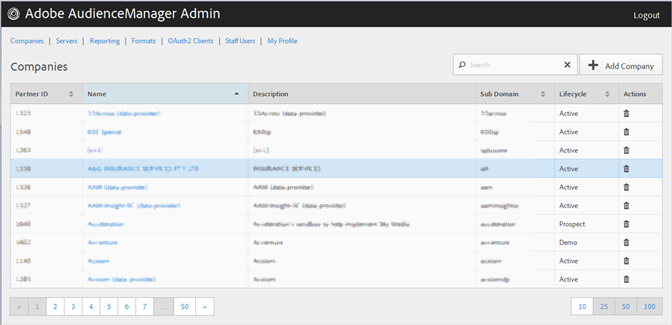

# Società {#companies}

Utilizza il [!UICONTROL Companies] per visualizzare un elenco di aziende nella configurazione dell’Audience Manager. Puoi modificare o eliminare aziende esistenti o crearne di nuove, purché siano stati assegnati i ruoli utente appropriati.

Puoi ordinare ogni colonna in ordine crescente o decrescente facendo clic sull’intestazione della colonna desiderata.

Utilizza il [!UICONTROL Search] o i controlli di impaginazione nella parte inferiore dell&#39;elenco per individuare la società desiderata.
