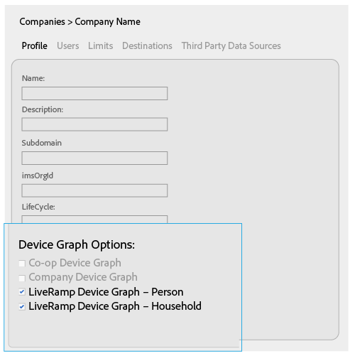
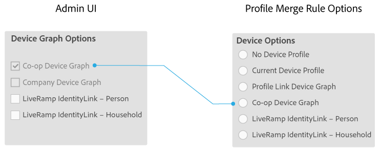
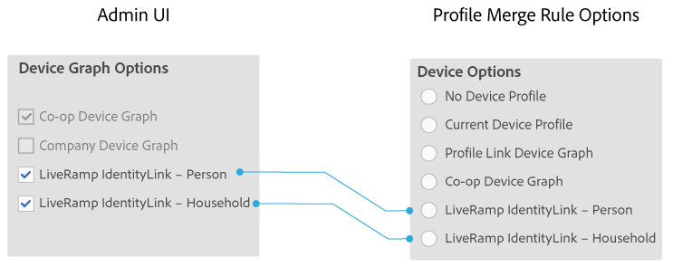

# Opzioni grafico dispositivo per aziende {#device-graph-options-for-companies}

Sono [!UICONTROL Device Graph Options] disponibili per le aziende che partecipano all' [!DNL Adobe Experience Cloud Device Co-op]evento. Se un cliente ha anche una relazione contrattuale con un fornitore di grafici di dispositivi terzi integrato con Audience Manager, questa sezione mostrerà le opzioni per quel grafico del dispositivo. Queste opzioni si trovano in [!UICONTROL Companies] &gt; nome società &gt; [!UICONTROL Profile] &gt; [!UICONTROL Device Graph Options].

Questa illustrazione utilizza nomi generici per le opzioni del grafico dei dispositivi di terze parti. In produzione, questi nomi provengono dal provider di grafico del dispositivo e possono variare da quello mostrato qui. Ad esempio, [!DNL LiveRamp] le opzioni di solito (non sempre):

* Inizia con «[!DNL LiveRamp]
* Contiene un nome di mezzo variabile
* Termina con "[!UICONTROL - Household]OR"[!UICONTROL -Person]

## Opzioni grafico dispositivo definite {#device-graph-options-defined}

Le opzioni del grafico dispositivo selezionate qui mostrano o nascondono [!UICONTROL Device Options] le scelte disponibili per un [!DNL Audience Manager] cliente quando creano un [!UICONTROL Profile Merge Rule].

### Co-op Device Graph {#co-op-graph}

I clienti che partecipano [ad Adobe Experience Cloud Device Co-op](https://marketing.adobe.com/resources/help/en_US/mcdc/) utilizzano queste opzioni per creare un insieme [!UICONTROL Profile Merge Rule] con [dati deterministici e probabilistici](https://marketing.adobe.com/resources/help/en_US/mcdc/mcdc-links.html). Attiva [!DNL Corporate Provisioning Team] e disattiva questa opzione tramite una [!DNL API] chiamata back-end. Non è possibile controllare o cancellare queste caselle nel [!DNL Admin UI]file. Inoltre, le **[!UICONTROL Co-op Device Graph]** opzioni e **[!UICONTROL Company Device Graph]** sono mutualmente esclusive. I clienti possono chiedere di attivare uno o l'altro, ma non entrambi. Quando questa opzione è selezionata, viene visualizzato il **[!UICONTROL Co-op Device Graph]** controllo nelle [!UICONTROL Device Options] impostazioni di un [!UICONTROL Profile Merge Rule].

### Company Device Graph {#company-graph}

Questa opzione è destinata [!DNL Analytics] ai clienti che utilizzano la [!UICONTROL People] metrica nella suite [!DNL Analytics] di rapporti. Attiva [!DNL Corporate Provisioning Team] e disattiva questa opzione tramite una [!DNL API] chiamata back-end. Non è possibile controllare o cancellare queste caselle nel [!DNL Admin UI]file. Inoltre, le **[!UICONTROL Company Device Graph]** opzioni e **[!UICONTROL Co-op Device Graph]** sono mutualmente esclusive. I clienti possono chiedere di attivare uno o l'altro, ma non entrambi. Quando è selezionata:

* Questo grafico dispositivo utilizza dati deterministici appartenenti alla società che stai configurando (nessun dato probabilistico).
* [!DNL Audience Manager] crea automaticamente un [!UICONTROL Data Source] nome denominato `*`partner`*-Company Device Graph-Person`. Nella pagina [!UICONTROL Data Source] dei dettagli [!DNL Audience Manager] , i clienti possono cambiare il nome, la descrizione e l'applicazione [dei controlli per l'esportazione dati](https://marketing.adobe.com/resources/help/en_US/aam/c_dec.html) a questa origine dati.
* [!DNL Audience Manager] i clienti *non vedono* una nuova impostazione nella [!UICONTROL Device Options] sezione relativa a [!UICONTROL Profile Merge Rule].

### Liveramp Device Graph (Persona o Famiglia) {#liveramp-device-graph}

Queste caselle di controllo sono attivate nel [!DNL Admin UI] momento in cui un partner crea e [!UICONTROL Data Source] seleziona **[!UICONTROL Use as an Authenticated Profile]** e/o **[!UICONTROL Use as a Device Graph]**. I nomi di queste impostazioni sono determinati dal provider di grafici dispositivo di terze parti (ad es. [!DNL LiveRamp][!DNL TapAd], ecc.). Quando questa opzione è attivata, significa che la società che state configurando userà i dati forniti da questi grafici dispositivo.

>[!MORE_ LIKE_ THIS]
>
>* [Opzioni regola unione profilo definite](https://marketing.adobe.com/resources/help/en_US/aam/merge-rule-definitions.html)
>* [Impostazioni origine dati e Opzioni menu](https://marketing.adobe.com/resources/help/en_US/aam/datasource-settings-definitions.html)

