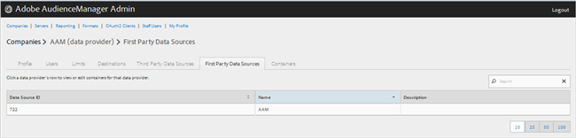
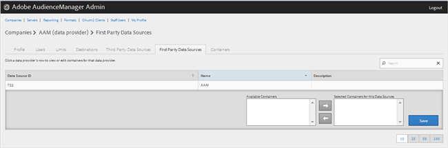

# Gestire i provider dati di prime parti {#manage-first-party-data-providers}

Visualizza o modifica contenitori e mappature per fornitori di dati di prime parti.

<!-- t_first_party_providers.xml -->

1. Fare clic su **[!UICONTROL Companies]**, quindi individuare e fare clic sulla società desiderata per visualizzare la relativa pagina [!UICONTROL Profile]. Utilizzate la casella [!UICONTROL Search] o i controlli di impaginazione in fondo all&#39;elenco per trovare la società desiderata. Potete ordinare ciascuna colonna in ordine crescente o decrescente facendo clic sull’intestazione della colonna desiderata.

1. Fare clic sulla scheda **[!UICONTROL First Party Data Providers]**.

   

1. Fare clic sulla riga di un provider di dati per visualizzare o modificare contenitori e mappature per tale provider di dati.

   

1. Spostate i contenitori dagli elenchi **[!UICONTROL Available Containers]** e **[!UICONTROL Selected Containers for This Data Provider]** selezionando i contenitori desiderati, quindi facendo clic sulle frecce a destra o a sinistra, a seconda delle necessità.
1. Fate clic su **[!UICONTROL Save]** se avete apportato delle modifiche.