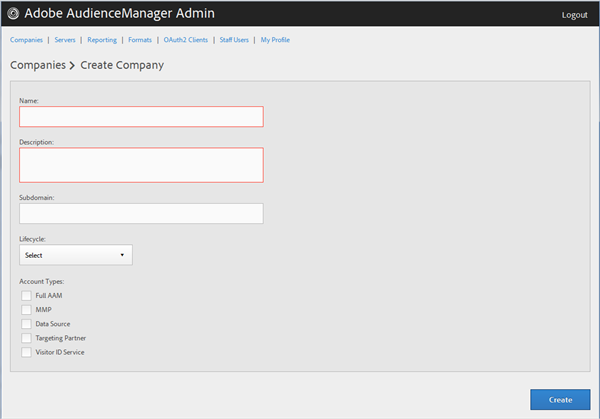
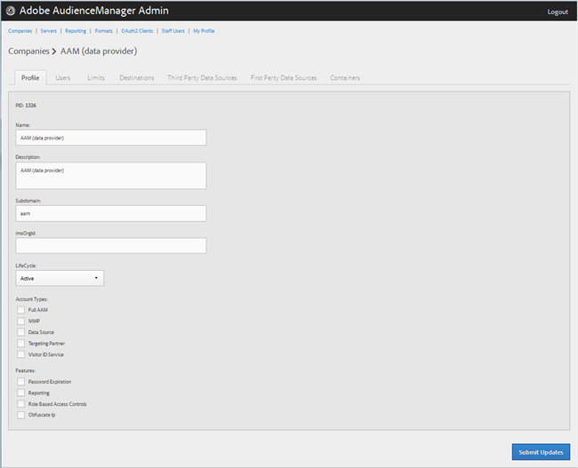

# Creare un profilo società {#create-a-company-profile}

Utilizza la pagina [!UICONTROL Companies] nello strumento Amministratore Audience Manager per creare una nuova azienda.

<!-- t_create_company.xml -->

>[!NOTE]
>
>Per creare nuove aziende, devi disporre del ruolo **[!UICONTROL DEXADMIN]** .

1. Clic **[!UICONTROL Companies]** > **[!UICONTROL Add Company]**.
1. Compila i campi:

   * **[!UICONTROL Name]**: (Obbligatorio) Specifica il nome della società.
   * **[!UICONTROL Description]**: (Obbligatorio) Fornire informazioni descrittive sull&#39;azienda, ad esempio l&#39;industria o il suo nome completo.
   * **[!UICONTROL Subdomain]**: (Obbligatorio) Specifica il sottodominio della società. Il testo immesso è quello che viene visualizzato come sottodominio della chiamata dell’evento. Questo non può essere cambiato. Deve essere una stringa di caratteri [!DNL URL]-validi.

      Ad esempio, se la società è stata denominata [!DNL AcmeCorp], il sottodominio sarà [!DNL acmecorp].

      Audience Manager utilizza il sottodominio per [!UICONTROL Data Collection Server] (DCS). Nell&#39;esempio precedente, se l&#39;azienda è piena [!DNL URL] in [!UICONTROL DCS], sarà [!DNL acmecorp.demdex.net].

   * **[!UICONTROL Lifecyle]**: Specifica la fase desiderata per l’azienda:
      * **[!UICONTROL Active]**: Specifica che la società sarà un client di Audience Manager attivo. Un account [!UICONTROL Active] significa un cliente pagante, non solo per la consulenza, ma per l&#39;SKU Audience Manager.
      * **[!UICONTROL Demo]**: Specifica che la società sarà solo a scopo dimostrativo. I dati di reporting verranno automaticamente falsificati.
      * **[!UICONTROL Prospect]**: Specifica che la società è un potenziale cliente di Audience Manager, ad esempio una società a cui viene dato un gratis  [!DNL POC] o un account impostato per una demo di vendita.
      * **[!UICONTROL Test]**: Specifica che la società sarà a scopo di test interno.
   * **[!UICONTROL Account Types]**: Specifica l&#39;intero set di tipi di account per l&#39;azienda. Nessun tipo di account si esclude a vicenda con qualsiasi altro tipo.
      * **[!UICONTROL Full AAM]**: Specifica che l&#39;azienda avrà un account Adobe Audience Manager completo e gli utenti avranno accesso all&#39;accesso.
      * **[!UICONTROL MMP]**: Specifica che l’azienda è stata abilitata per utilizzare le funzionalità  [!UICONTROL Master Marketing Profile] ([!UICONTROL MMP]) . Il [!UICONTROL MMP] consente ai tipi di pubblico di essere condivisi in tutto l’Experience Cloud utilizzando un [!UICONTROL Experience Cloud ID] ([!DNL MCID]) assegnato a ogni visitatore e quindi utilizzato per Audience Manager. Se selezioni questo tipo di account, anche [!UICONTROL Experience Cloud ID Service] viene selezionato automaticamente.

         Per ulteriori informazioni, consulta [Tipi di pubblico di Experience Cloud](https://experienceleague.adobe.com/docs/core-services/interface/services/audiences/audience-library.html?lang=en).
   * **[!UICONTROL Data Source]**: Specifica che l’azienda è un provider di dati di terze parti all’interno di Audience Manager.
   * **[!UICONTROL Targeting Partner]**: Specifica che l’azienda agisce come piattaforma di targeting per i clienti di Audience Manager.
   * **[!UICONTROL Visitor ID Service]**: Specifica che la società è stata abilitata per utilizzare  [!UICONTROL Experience Cloud Visitor ID Service].

      Il [!UICONTROL Experience Cloud Visitor ID Service] fornisce un ID visitatore universale nelle soluzioni Experience Cloud. Per ulteriori informazioni, consulta la [guida utente del servizio ID visitatore di Experience Cloud](https://experienceleague.adobe.com/docs/id-service/using/intro/overview.html?lang=en).

   * **[!UICONTROL Agency]**: Specifica che l&#39;azienda avrà un  [!UICONTROL Agency] account.

1. Clic **[!UICONTROL Create]**. Segui le istruzioni riportate in [Modifica un profilo società](../companies/admin-manage-company-profiles.md#edit-company-profile).

   

## Modificare un profilo società {#edit-company-profile}

Modifica il profilo di un&#39;azienda, compresi nome, descrizione, sottodominio, ciclo di vita e altro ancora.

<!-- t_edit_company_profile.xml -->

1. Fai clic su **[!UICONTROL Companies]**, quindi individua e fai clic sulla società desiderata per visualizzare la relativa pagina [!UICONTROL Profile].

   Utilizza la casella [!UICONTROL Search] o i controlli di impaginazione in fondo all’elenco per trovare l’azienda desiderata. Per ordinare ciascuna colonna in ordine crescente o decrescente, fai clic sull’intestazione della colonna desiderata.

   

1. Modifica i campi in base alle esigenze:

   * **[!UICONTROL Name]**: Modifica il nome della società. Questo campo è obbligatorio.
   * **[!UICONTROL Description]**: Modifica la descrizione della società. Questo campo è obbligatorio.
   * **[!UICONTROL Subdomain]**: (Obbligatorio) Specifica il sottodominio della società. Il testo immesso è quello che viene visualizzato come sottodominio della chiamata dell’evento. Questo non può essere cambiato. Deve essere una stringa di caratteri [!DNL URL]-validi.

      Ad esempio, se la società è stata denominata [!DNL AcmeCorp], il sottodominio sarà [!DNL acmecorp].

      Audience Manager utilizza il sottodominio per [!UICONTROL Data Collection Server] (DCS). Nell&#39;esempio precedente, se l&#39;azienda è piena [!DNL URL] in [!UICONTROL DCS], sarà [!DNL acmecorp.demdex.net].

   * **[!UICONTROL imsOrgld]**: ([!UICONTROL Identity Management System Organization ID]) Questo ID consente di collegare la tua azienda a Adobe Experience Cloud.
   * **[!UICONTROL Lifecyle]**: Specifica la fase desiderata per l’azienda:
      * **[!UICONTROL Active]**: Specifica che la società sarà un client di Audience Manager attivo. Un conto attivo significa un cliente pagante, non solo per la consulenza, ma per lo SKU Audience Manager.
      * **[!UICONTROL Demo]**: Specifica che la società sarà solo a scopo dimostrativo. I dati di reporting verranno automaticamente falsificati.
      * **[!UICONTROL Prospect]**: Specifica che la società è un potenziale cliente di Audience Manager, ad esempio una società a cui viene dato un gratis  [!DNL POC] o un account impostato per una demo di vendita.
      * **[!UICONTROL Test]**: Specifica che la società sarà a scopo di test interno.
   * **[!UICONTROL Account Types]**: Specifica l&#39;intero set di tipi di account per l&#39;azienda. Nessun tipo di account si esclude a vicenda con qualsiasi altro tipo.
      * **[!UICONTROL Full AAM]**: Specifica che l&#39;azienda avrà un account Adobe Audience Manager completo e gli utenti avranno accesso all&#39;accesso.
      * **[!UICONTROL MMP]**: Specifica che l’azienda è stata abilitata per utilizzare le funzionalità Profilo di marketing principale ([!UICONTROL MMP]).

         Se selezioni questo tipo di account, anche **[!UICONTROL Visitor ID Service]** viene selezionato automaticamente.
Per ulteriori informazioni, consulta [Tipi di pubblico di Experience Cloud](https://experienceleague.adobe.com/docs/core-services/interface/services/audiences/audience-library.html?lang=en).
   * **[!UICONTROL Data Source]**: Specifica che l’azienda è un provider di dati di terze parti all’interno di Audience Manager.
   * **[!UICONTROL Targeting Partner]**: Specifica che l’azienda agisce come piattaforma di targeting per i clienti di Audience Manager.
   * **[!UICONTROL Visitor ID Service]**: Specifica che l’azienda è stata abilitata per l’uso del servizio ID visitatori di Experience Cloud.

      Il servizio ID visitatore di Experience Cloud fornisce un ID visitatore universale nelle soluzioni Experience Cloud. Per ulteriori informazioni, consulta la [guida utente del servizio Experience Cloud ID](https://experienceleague.adobe.com/docs/id-service/using/home.html?lang=en).

   * **[!UICONTROL Agency]**: Specificare che l&#39;azienda avrà un account Agenzia.
   * **[!UICONTROL Features]**: Seleziona le opzioni desiderate:
      * **[!UICONTROL Password Expiration]**: Imposta la scadenza di tutte le password utente all&#39;interno della società dopo 90 giorni per aumentare la sicurezza Audience Manager.
      * **[!UICONTROL Reporting]**: Abilita il reporting di Audience Manager per questa società.
      * **[!UICONTROL Role Based Access Controls]**: Abilita controlli di accesso basati sui ruoli per questa azienda. I controlli di accesso basati sul ruolo ti consentono di creare gruppi di utenti con diverse autorizzazioni di accesso. I singoli utenti all’interno di questi gruppi possono quindi accedere solo alle funzioni specifiche di Audience Manager.

1. Clic **[!UICONTROL Submit Updates]**.

## Eliminare un profilo società {#delete-company-profile}

Utilizza la pagina [!UICONTROL Companies] nello strumento Audience Manager [!UICONTROL Admin] per eliminare una società esistente.

<!-- t_delete_company.xml -->

>[!NOTE]
>
>Per eliminare le aziende esistenti è necessario disporre del ruolo [!UICONTROL DEXADMIN] .

1. Per eliminare una società esistente, fai clic su **[!UICONTROL Companies]**.

   

1. Fai clic su  nella colonna **[!UICONTROL Actions]** della società desiderata.
1. Fai clic su **[!UICONTROL OK]** per confermare l’eliminazione.
