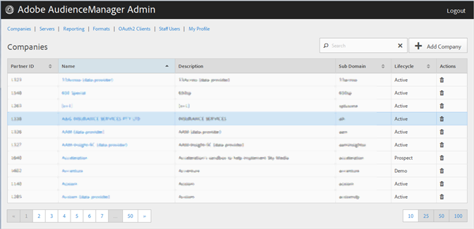

# Creare un profilo società {#create-a-company-profile}

Utilizzate la pagina [!UICONTROL Companies] nello strumento Amministrazione Audience Manager  per creare una nuova società.

<!-- t_create_company.xml -->

>[!NOTE]
>
>Per creare nuove società è necessario disporre del ruolo **[!UICONTROL DEXADMIN]**.

1. Clic **[!UICONTROL Companies]** > **[!UICONTROL Add Company]**.
1. Compila i campi:

   * **[!UICONTROL Name]**: (Obbligatorio) Specificate il nome della società.
   * **[!UICONTROL Description]**: (Obbligatorio) Fornire informazioni descrittive sulla società, come l&#39;industria o il suo nome completo.
   * **[!UICONTROL Subdomain]**: (Obbligatorio) Specifica il sottodominio della società. Il testo immesso è quello che viene visualizzato come sottodominio della chiamata dell’evento. Questo non può essere cambiato. Deve essere una stringa di caratteri [!DNL URL] validi.

      Ad esempio, se la società è stata denominata [!DNL AcmeCorp], il sottodominio sarà [!DNL acmecorp].

       Audience Manager utilizza il sottodominio per il [!UICONTROL Data Collection Server] (DCS). Nell&#39;esempio precedente, se l&#39;intero [!DNL URL] della società in [!UICONTROL DCS] è [!DNL acmecorp.demdex.net].

   * **[!UICONTROL Lifecyle]**: Specificate la fase desiderata per la società:
      * **[!UICONTROL Active]**: Specificate che la società sarà un client  Audience Manager attivo. Un conto [!UICONTROL Active] indica un cliente pagante, non solo per la consulenza, ma per lo SKU  Audience Manager.
      * **[!UICONTROL Demo]**: Specificate che la società sarà solo a scopo dimostrativo. I dati di reporting verranno automaticamente falsificati.
      * **[!UICONTROL Prospect]**: Specificate che la società è un potenziale cliente  Audience Manager, ad esempio una società a cui viene concesso un account gratuito  [!DNL POC] o un account impostato per una dimostrazione di vendita.
      * **[!UICONTROL Test]**: Specificate che la società sarà solo a scopo di test interno.
   * **[!UICONTROL Account Types]**: Specifica l&#39;intero set di tipi di account per la società. Nessun tipo di account si esclude a vicenda con qualsiasi altro tipo.
      * **[!UICONTROL Full AAM]**: Specificate che la società avrà un account Adobe Audience Manager completo e che gli utenti avranno accesso.
      * **[!UICONTROL MMP]**: Specificate che la società è stata abilitata per utilizzare le funzionalità  [!UICONTROL Master Marketing Profile] ([!UICONTROL MMP]). [!UICONTROL MMP] consente di condividere i tipi di pubblico in tutto il Experience Cloud  utilizzando un [!UICONTROL Experience Cloud ID] ([!DNL MCID]) assegnato a ogni visitatore e quindi utilizzato da  Audience Manager. Se si seleziona questo tipo di account, viene selezionata automaticamente anche la [!UICONTROL Experience Cloud ID Service].

         Per ulteriori informazioni, vedi [Audiences Services - Master Marketing Profile](https://marketing.adobe.com/resources/help/en_US/mcloud/audience_library.html).
   * **[!UICONTROL Data Source]**: Specifica che la società è un provider di dati di terze parti all&#39;interno  Audience Manager.
   * **[!UICONTROL Targeting Partner]**: Specificate che la società funga da piattaforma di targeting per i clienti  Audience Manager.
   * **[!UICONTROL Visitor ID Service]**: Specificate che la società è stata abilitata per l&#39;utilizzo del  [!UICONTROL Experience Cloud Visitor ID Service].

      [!UICONTROL Experience Cloud Visitor ID Service] fornisce un ID visitatore universale nelle soluzioni  Experience Cloud. Per ulteriori informazioni, consulta la [Guida utente del servizio ID visitatori di  Experience Cloud](https://marketing.adobe.com/resources/help/en_US/mcvid/mcvid-overview.html).

   * **[!UICONTROL Agency]**: Specificate che la società avrà un  [!UICONTROL Agency] account.

1. Clic **[!UICONTROL Create]**. Seguite le istruzioni riportate in [Modifica di un profilo aziendale](../companies/admin-manage-company-profiles.md#edit-company-profile).

   

## Modificare un profilo società {#edit-company-profile}

Modifica il profilo di una società, incluso nome, descrizione, sottodominio, ciclo di vita e altro.

<!-- t_edit_company_profile.xml -->

1. Fare clic su **[!UICONTROL Companies]**, quindi individuare e fare clic sulla società desiderata per visualizzare la relativa pagina [!UICONTROL Profile].

   Utilizzate la casella [!UICONTROL Search] o i controlli di impaginazione in fondo all&#39;elenco per trovare la società desiderata. Potete ordinare ciascuna colonna in ordine crescente o decrescente facendo clic sull’intestazione della colonna desiderata.

   

1. Modificate i campi come necessario:

   * **[!UICONTROL Name]**: Modificate il nome della società. Questo campo è obbligatorio.
   * **[!UICONTROL Description]**: Modificate la descrizione della società. Questo campo è obbligatorio.
   * **[!UICONTROL Subdomain]**: (Obbligatorio) Specifica il sottodominio della società. Il testo immesso è quello che viene visualizzato come sottodominio della chiamata dell’evento. Questo non può essere cambiato. Deve essere una stringa di caratteri [!DNL URL] validi.

      Ad esempio, se la società è stata denominata [!DNL AcmeCorp], il sottodominio sarà [!DNL acmecorp].

       Audience Manager utilizza il sottodominio per il [!UICONTROL Data Collection Server] (DCS). Nell&#39;esempio precedente, se l&#39;intero [!DNL URL] della società in [!UICONTROL DCS] è [!DNL acmecorp.demdex.net].

   * **[!UICONTROL imsOrgld]**: ([!UICONTROL Identity Management System Organization ID]) Questo ID consente di collegare la società all’Adobe Experience Cloud.
   * **[!UICONTROL Lifecyle]**: Specificate la fase desiderata per la società:
      * **[!UICONTROL Active]**: Specificate che la società sarà un client  Audience Manager attivo. Un conto attivo significa un cliente pagante, non solo per la consulenza, ma per lo SKU  Audience Manager.
      * **[!UICONTROL Demo]**: Specificate che la società sarà solo a scopo dimostrativo. I dati di reporting verranno automaticamente falsificati.
      * **[!UICONTROL Prospect]**: Specificate che la società è un potenziale cliente  Audience Manager, ad esempio una società a cui viene concesso un account gratuito  [!DNL POC] o un account impostato per una dimostrazione di vendita.
      * **[!UICONTROL Test]**: Specificate che la società sarà solo a scopo di test interno.
   * **[!UICONTROL Account Types]**: Specifica l&#39;intero set di tipi di account per la società. Nessun tipo di account si esclude a vicenda con qualsiasi altro tipo.
      * **[!UICONTROL Full AAM]**: Specificate che la società avrà un account Adobe Audience Manager completo e che gli utenti avranno accesso.
      * **[!UICONTROL MMP]**: Specificate che la società è stata abilitata per utilizzare le funzionalità del profilo marketing principale ([!UICONTROL MMP]).

         Se si seleziona questo tipo di account, viene selezionato automaticamente anche **[!UICONTROL Visitor ID Service]**.
Per ulteriori informazioni, vedi [Audiences Services - Master Marketing Profile](https://marketing.adobe.com/resources/help/en_US/mcloud/audience_library.html).
   * **[!UICONTROL Data Source]**: Specifica che la società è un provider di dati di terze parti all&#39;interno  Audience Manager.
   * **[!UICONTROL Targeting Partner]**: Specificate che la società funga da piattaforma di targeting per i clienti  Audience Manager.
   * **[!UICONTROL Visitor ID Service]**: Specifica che la società è stata abilitata per utilizzare il servizio ID visitatori  Experience Cloud.

      Il servizio ID visitatore  Experience Cloud fornisce un ID visitatore universale nelle soluzioni  Experience Cloud. Per ulteriori informazioni, consulta la [Guida utente del servizio ID visitatori di  Experience Cloud](https://microsite.omniture.com/t2/help/en_US/mcvid/mcvid_service.html).

   * **[!UICONTROL Agency]**: Specificate che la società avrà un account Agenzia.
   * **[!UICONTROL Features]**: Selezionate le opzioni desiderate:
      * **[!UICONTROL Password Expiration]**: Imposta la scadenza di tutte le password utente all&#39;interno della società dopo 90 giorni per aumentare  sicurezza Audience Manager.
      * **[!UICONTROL Reporting]**: Abilita il reporting  Audience Manager per questa società.
      * **[!UICONTROL Role Based Access Controls]**: Abilita controlli di accesso basati sui ruoli per questa società. I controlli di accesso basati sul ruolo consentono di creare gruppi di utenti con autorizzazioni di accesso diverse. I singoli utenti all’interno di questi gruppi possono quindi accedere solo a funzioni specifiche  Audience Manager.

1. Clic **[!UICONTROL Submit Updates]**.

## Eliminare un profilo aziendale {#delete-company-profile}

Utilizzare la pagina [!UICONTROL Companies] nello strumento Audience Manager  [!UICONTROL Admin] per eliminare una società esistente.

<!-- t_delete_company.xml -->

>[!NOTE]
>
>Per eliminare le società esistenti è necessario disporre del ruolo [!UICONTROL DEXADMIN].

1. Per eliminare una società esistente, fate clic su **[!UICONTROL Companies]**.

   

1. Fare clic su  nella colonna **[!UICONTROL Actions]** della società desiderata.
1. Fare clic su **[!UICONTROL OK]** per confermare l&#39;eliminazione.
