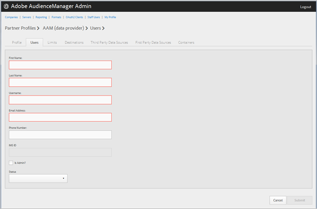

# Gestire gli utenti aziendali {#manage-company-users}

Creare nuovi utenti  Audience Manager o modificare ed eliminare utenti esistenti.

<!-- t_manage_company_users.xml -->

1. Fare clic su **[!UICONTROL Companies]**, quindi individuare e fare clic sulla società desiderata per visualizzare la relativa pagina [!UICONTROL Profile].

   Utilizzate la casella [!UICONTROL Search] o i controlli di impaginazione in fondo all&#39;elenco per trovare la società desiderata. Potete ordinare ciascuna colonna in ordine crescente o decrescente facendo clic sull’intestazione della colonna desiderata.
1. Fare clic sulla scheda **[!UICONTROL Users]**.
1. Per creare un nuovo utente, fate clic su **[!UICONTROL Create a New User]**. Per modificare un utente esistente, individuare e fare clic sull&#39;utente desiderato nella colonna **[!UICONTROL Username]**.

   

1. Compila i campi:

   * **[!UICONTROL First Name]**: (Obbligatorio) Specificate il nome dell&#39;utente.
   * **[!UICONTROL Last Name]**: (Obbligatorio) Specificate il cognome dell&#39;utente.
   * **[!UICONTROL Username]**: (Obbligatorio) Specificate il nome utente  Audience Manager dell&#39;utente. I nomi utente devono essere univoci.
   * **[!UICONTROL Email Address]**: (Obbligatorio) Specificate l&#39;indirizzo e-mail dell&#39;utente.
   * **[!UICONTROL Phone Number]**: Specificate il numero di telefono dell&#39;utente.
   * **[!UICONTROL IMS ID]**: L&#39;utente è  [!UICONTROL Identity Management System ID]. Questo ID consente all’utente di collegarsi  soluzioni di Adobe all’Adobe Experience Cloud.
   * **[!UICONTROL Is Admin]**: Impostate questo utente come utente amministrativo  Audience Manager. Un amministratore ha tutti  ruoli utente Audience Manager per il partner.
   * **[!UICONTROL Status]**: Durante la creazione di un nuovo utente, questo campo viene inizialmente visualizzato come  **[!UICONTROL Pending]** finché l&#39;utente non effettua l&#39;accesso e reimposta la password temporanea. Se state modificando un utente esistente, potete selezionare uno dei seguenti stati:
      * **[!UICONTROL Active]**: Specifica che questo utente è un utente  Audience Manager attivo.
      * **[!UICONTROL Deactivated]**: Specifica che questo utente è un utente  Audience Manager disattivato.
      * **[!UICONTROL Expired]**: Specifica che questo utente è scaduto.
      * **[!UICONTROL Locked Out]**: Specifica che questo utente è un utente bloccato.

1. Clic **[!UICONTROL Submit]**.

## Eliminare un utente {#delete-user}

Per eliminare un utente:

1. Fare clic su **[!UICONTROL Companies]**, individuare e fare clic sulla società desiderata, quindi fare clic sulla scheda **[!UICONTROL Users]**.
1. Fare clic su  nella colonna **[!UICONTROL Actions]** dell&#39;utente desiderato.
1. Fare clic su **[!UICONTROL OK]** per confermare l&#39;eliminazione.