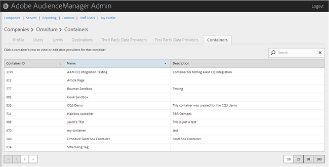
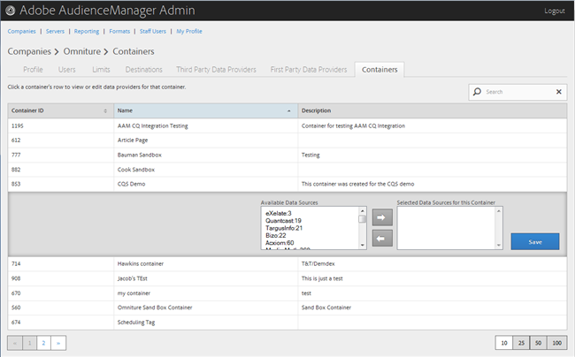

# Gestire i contenitori {#manage-containers}

Visualizza o modifica i provider di dati per i contenitori.

<!-- t_containers.xml -->

>[!NOTE]
>
>Per impostazione predefinita, le società vengono create con un contenitore. Puoi creare altri contenitori per un’azienda nell’interfaccia utente di, in **[!UICONTROL Tools > Tags]**.

1. Clic **[!UICONTROL Companies]**, quindi individuare e fare clic sulla società desiderata per visualizzare [!UICONTROL Profile] pagina.

   Utilizza il [!UICONTROL Search] o i controlli di impaginazione nella parte inferiore dell&#39;elenco per individuare la società desiderata. Puoi ordinare ogni colonna in ordine crescente o decrescente facendo clic sull’intestazione della colonna desiderata.

1. Fai clic su **[!UICONTROL Containers]** scheda.

   

1. Fai clic sulla riga di un contenitore per visualizzare o modificare i provider di dati per quel contenitore.

   

1. Sposta origini dati da **[!UICONTROL Available Data Sources]** e **[!UICONTROL Selected Data Sources for This Container]** seleziona le origini dati desiderate, quindi fai clic sulle frecce destra o sinistra, a seconda delle necessità.

   Puoi eseguire questa attività anche dal [Fornitori di dati di terze parti](../companies/admin-third-party-providers.md#task_E942DD674D794BA6B8EFD52FD866E689)pagina.

1. Clic **[!UICONTROL Save]** se hai apportato modifiche.

>[!MORELIKETHIS]
>
>* [Sincronizzazione ID con Media Optimizer](../companies/admin-amo-sync.md#concept_2B5537233DAA4860B3503B344F937D83)

