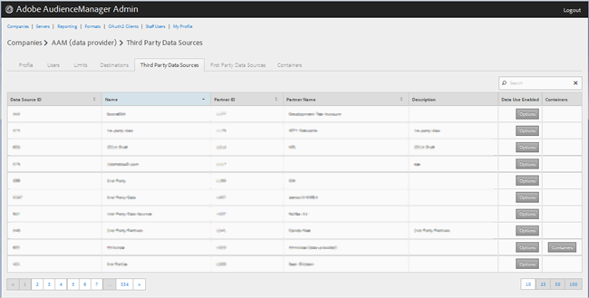
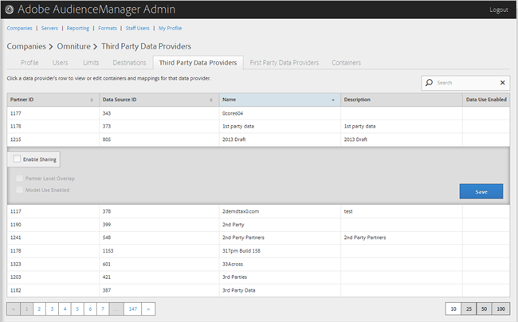

# Gestione di provider di dati di terze parti {#manage-third-party-data-providers}

Visualizzare o modificare contenitori e mappature per fornitori di dati di terze parti. Potete inoltre abilitare la condivisione con fornitori di dati diversi.

1. Fate clic **[!UICONTROL Companies]**, quindi individuate e fate clic sulla società desiderata per visualizzare la [!UICONTROL Profile] pagina.

   Utilizzate la [!UICONTROL Search] casella o i controlli di impaginazione in fondo all’elenco per trovare la società desiderata. Potete ordinare ciascuna colonna in ordine crescente o decrescente facendo clic sull’intestazione della colonna desiderata.
1. Click the **[!UICONTROL Third Party Data Providers]** tab.

   

1. Fare clic sulla riga di un provider di dati per visualizzare o modificare contenitori e mappature per tale provider di dati.

   

1. Selezionate **[!UICONTROL Enable Sharing]** per attivare le seguenti opzioni:

   * **Sovrapposizione livello partner:**
   * **** Uso modello abilitato: Consente a questa società di utilizzare questo provider di dati durante la creazione di modelli algoritmici.
   Quando abilitate la condivisione, potete accedere alle caratteristiche da questo provider di dati.

1. (Condizionale) Se il contenitore è abilitato per questo provider, è possibile selezionare i contenitori per questo provider di dati spostando i contenitori desiderati dall'elenco disponibile all'elenco selezionato.

   Potete eseguire questa operazione anche dalla pagina [Contenitori](../companies/admin-manage-containers.md#task_61DB5CEECC5049DD8D059C642AC3F967) .
1. Fate clic su **[!UICONTROL Save]** se avete apportato delle modifiche.