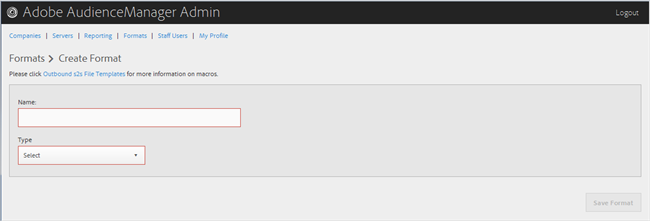

# Creare o modificare un formato {#create-or-edit-a-format}

Utilizza il [!UICONTROL Formats] nello strumento di amministrazione Audience Manager per creare un nuovo formato o modificare un formato esistente.

<!-- t_create_format.xml -->

>[!TIP]
>
>Quando selezioni un formato per i dati in uscita, è consigliabile, se possibile, riutilizzare un formato esistente. L’utilizzo di un formato già collaudato garantisce che i dati in uscita vengano generati correttamente. Per visualizzare esattamente la formattazione di un formato esistente, fare clic sul pulsante [!UICONTROL Formats] nella barra dei menu e cercare il formato in base al nome o al numero ID. I formati non validi o le macro utilizzate nei formati forniscono un output formattato in modo errato o impediscono la trasmissione completa delle informazioni.

1. Per creare un nuovo formato, fai clic su **[!UICONTROL Formats]** > **[!UICONTROL Add Format]**. Per modificare un formato esistente, fare clic sul formato desiderato nella **[!UICONTROL Name]** colonna.

   

1. Compila i campi:
   * **Nome:** (Obbligatorio) Fornisci un nome descrittivo per il formato.
   * **Tipo:** (Obbligatorio) Seleziona il formato desiderato:
      * **[!UICONTROL File]**: invia dati tramite [!DNL FTP] file.
      * **[!UICONTROL HTTP]**: racchiude i dati in una [!DNL JSON] wrapper.

1. (Condizionale) Se hai scelto **[!UICONTROL File]**, compila i campi:

   >[!NOTE]
   >
   >Per un elenco delle macro disponibili, vedere [Macro per formati file](../formats/file-formats.md#concept_A867101505074418A58DE325949E5089) e [Macro per il formato HTTP](../formats/web-formats.md#reference_C392124A5F3F42E49F8AADDBA601ADFE).

   * **[!UICONTROL File Name]:** Specificare il nome del file di trasferimento dati.
   * **Intestazione** Specificare il testo visualizzato nella prima riga del file di trasferimento dati.
   * **[!UICONTROL Data Row]:** Specificare il testo visualizzato in ogni riga in uscita del file.
   * **[!UICONTROL Maximum File Size (In MB)]:** Specificare la dimensione massima del file per i file di trasferimento dati. I file compressi devono essere inferiori a 100 MB. Non esiste alcun limite alla dimensione del file non compresso.
   * **[!UICONTROL Compression]:** Seleziona il tipo di compressione desiderato: gz o zip per i file di dati. Per la consegna a [!UICONTROL AWS S3], è necessario utilizzare file .gz o non compressi.
   * **[!UICONTROL .info Receipt]:** Specifica che un controllo di trasferimento ([!DNL .info]) viene generato. Il [!DNL .info] file fornisce informazioni sui metadati relativi ai trasferimenti di file, in modo che i partner possano verificare che i trasferimenti di file gestiti da Audience Manager siano corretti. Per ulteriori informazioni, consulta [File di trasferimento dei controlli per trasferimenti di file di registro](https://experienceleague.adobe.com/docs/audience-manager/user-guide/implementation-integration-guides/receiving-audience-data/batch-outbound-data-transfers/transfer-control-files.html?lang=en).
   * **[!UICONTROL MD5 Checksum Receipt]:** Specifica che un [!DNL MD5] viene generata la ricevuta di checksum. Il [!DNL MD5] incasso checksum in modo che i partner possano verificare che Audience Manager abbia gestito correttamente il trasferimento completo.

1. (Condizionale) Se hai scelto **[!UICONTROL HTTP]**, compila i campi:

   * **[!UICONTROL Method]:** Scegli la [!DNL API] metodo da utilizzare per il processo di trasferimento:
      * **[!UICONTROL POST]:** Se si seleziona [!DNL POST], seleziona il tipo di contenuto ([!DNL XML] o [!DNL JSON]), quindi specifica il corpo della richiesta.
      * **[!UICONTROL GET]:** Se si seleziona [!DNL GET], specifica i parametri di query.

1. Clic **[!UICONTROL Create]** se si sta creando un nuovo formato, oppure fare clic su **[!UICONTROL Save Updates]** se si sta modificando un formato esistente.

## Eliminare un formato {#delete-format}

1. Clic **[!UICONTROL Formats]**.
2. Clic   nel **[!UICONTROL Actions]** del formato desiderato.
3. Clic **[!UICONTROL OK]** per confermare l’eliminazione.
