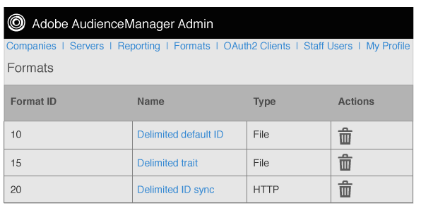

# Panoramica formati {#formats-overview}

Un formato è un modello o un file salvato che utilizza le macro per organizzare il contenuto dei dati inviati a una destinazione. I tipi di formattazione includono [!DNL HTTP] formati e formati di file. [!DNL HTTP] I formati inviano dati in un [!DNL JSON] oggetto con un metodo [!DNL POST] o [!DNL GET] un metodo. I formati di file inviano dati in un file. [!DNL FTP] Le macro utilizzate da ciascun formato consentono di impostare i nomi dei file, definire le intestazioni del file e organizzare i contenuti di un file di dati. Nell'Admin [!DNL UI], puoi creare, salvare e ri-utilizzare i formati durante l'impostazione delle destinazioni per i clienti.

